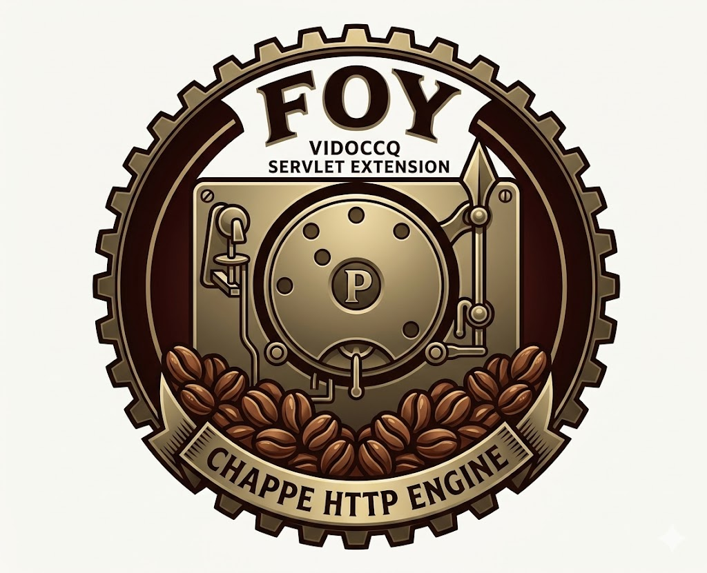

---
<p align="center">
  
</p>

<h1 align="center">Foy</h1>

<p align="center">
  <strong>Jakarta Servlet 6.1 implementation — pure engine, HTTP transport via SPI, optional CDI</strong><br>
  <a href="https://jakarta.ee/specifications/servlet/6.1/">Jakarta Servlet 6.1</a> | Native Java Modules | Virtual Threads | JDK 25
</p>

<p align="center">
  
  
  
  
</p>

---

Standalone **Jakarta Servlet 6.1** implementation — pure Servlet engine, HTTP transport
via SPI, optional CDI.

Extracted in April 2026 from the
[`vidocq-runtime-servlet-chappe-extension`](https://codefloe.com/Vidocq/vidocq)
module to become an independent project usable outside the Vidocq Runtime ecosystem.

## Modules

| Module | Description |
| --- | --- |
| `foy-api` | Public SPI interfaces: `SessionStore`, `SecurityProvider`, `AuthenticatedUser`. Zero dependencies beyond `jakarta.servlet-api`. |
| `foy-core` | Servlet 6.1 engine — dispatcher, filter chain, session, error pages, listeners, security, web.xml, multipart. |
| `foy-processor` | Build-time annotation processor generating `X$$FoyComponent` companions and indexes. Zero dependency (`java.compiler` only); never shipped in the application. |
| `foy-cdi-vauban` | Bridge to the [Vauban](https://forge.vidocq.dev/vidocq/vauban) CDI container (`FoyVaubanBootstrap.beanManager()`). |
| `foy-chappe` | [Chappe](https://forge.vidocq.dev/vidocq/chappe) HTTP adapter (`FoyChappeBoot.builder().beanManager(bm).build()`). |
| `foy-tck` | Arquillian harness for the official Jakarta Servlet 6.1 TCK (in-reactor, gated by the `tck` Maven profile). |

## Status

**M1 — functional extraction**: the engine runs in standalone Vauban + Chappe mode.
The reactor (`foy-api`, `foy-core`, `foy-cdi-vauban`, `foy-chappe`) compiles without
blocking warnings.

**TCK at the Phase 3 exit (2026-10-09)** — full official Jakarta Servlet 6.1 suite:
**1587/1714 (92.6 %)**: `api.*` 821/859, `pluggability.*` 639/646, `spec.*` 127/207,
`compat.*` 0/2. The main remaining gaps are security enforcement, the default
servlet (welcome files), request dispatching, server push and a filter that runs
twice when mapped by pattern and by servlet name. Per-family breakdown, root
causes and roadmap in [`TCK.md`](TCK.md).

**TODO M2 — transport decoupling**:

- `foy-core` still depends directly on `chappe-api` (the bridges
  `HttpServletRequestImpl`, `HttpServletResponseImpl`, `ServletOutputStreamImpl`
  and `ChappeServletBridge` reference `chappe.api.Request/Response`).
  To be decoupled via a `FoyHttpExchange` SPI in `foy-api` (Cassini pattern:
  `CassiniHttpAdapter` + `CassiniHttpExchange`).
- Promote a `BeanProvider` SPI in `foy-api` to decouple
  `WebAppDiscovery` (which feeds `WebAppModel` for `WebAppDeployer`) from the direct `BeanManager` (enabling alternative CDI
  integrations — Weld, OpenWebBeans).
- Introduce a `FoyServletEngine` (equivalent to `CassiniStack`) with
  `Builder` + `BuilderFactory` discovered via `ServiceLoader`.

Once M2 is done, `foy-jdk-http`, `foy-jetty`, `foy-netty` can be written
without touching `foy-core`.

## Running the Jakarta Servlet 6.1 TCK

```sh
./run-official-tck-servlet6.1.sh           # smoke test
./run-official-tck-servlet6.1.sh --all     # full suite
./run-official-tck-servlet6.1.sh -Dtest=ServletTests
```

Prerequisites: official TCK artifacts installed locally
(`jakarta.tck:servlet-tck-runtime:6.1.0`, `servlet-tck-util:6.1.0`,
`servlet-tck:6.1.0`).

## Build

```sh
mvn clean install
```
